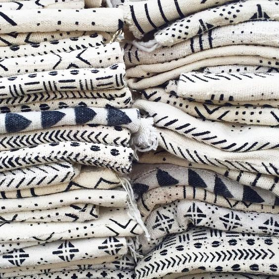

More than cloth, we at Upful experience how textiles capture the pure energy, patterns, rhthyms, and textures of everyday life. Textiles remind us that our world is not threadbare but an intricate tapestry, weaved out of both obvious and submerged interconnections. Our goal is to use our love for textiles to create reinspired and bespoke vintage clothing, accessories and home goods.

